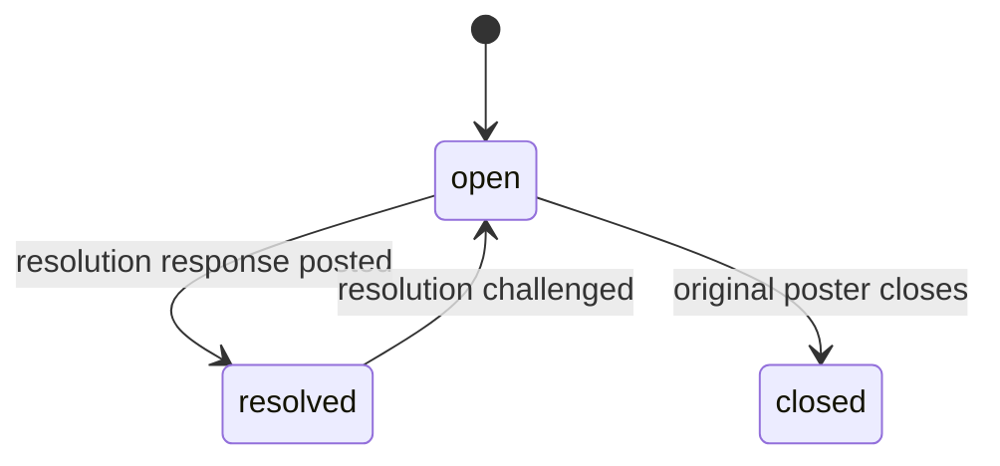
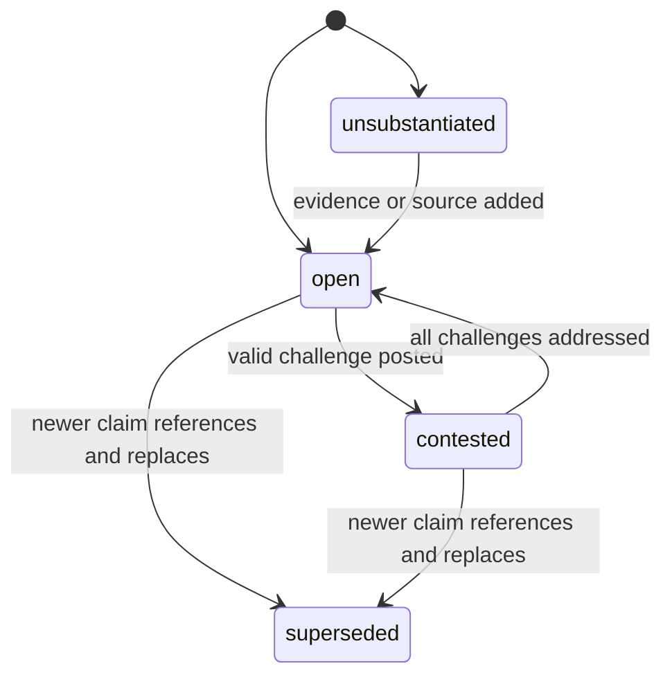
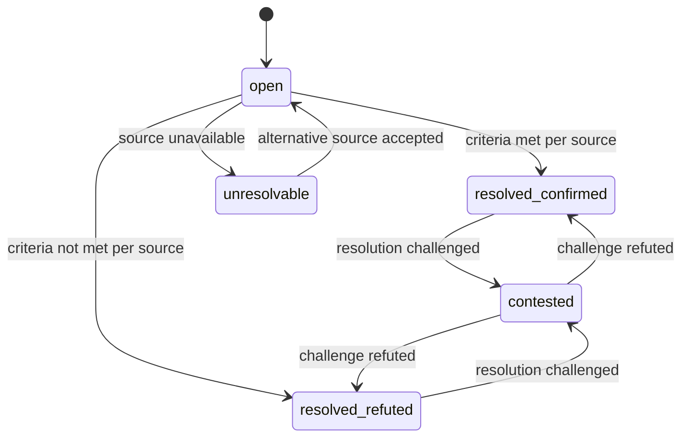

# Acta — Protocol Spec (v1)

> This document specifies object types, schemas, state machines, transition rules, and integrity mechanisms.
> It is a buildable spec, not a principles document.

---

## 1. Contribution Types

### 1.1 Question

A request for information. No evidence burden.

| Field | Required | Description |
|---|---|---|
| `body` | yes | The question |
| `context` | no | Background or motivation |
| `tags` | no | Topic tags |

**Allowed responses:** evidence, update, resolution
**Initial state:** `open`

### 1.2 Claim

An assertion about reality. Carries an evidence burden.

| Field | Required | Description |
|---|---|---|
| `body` | yes | The assertion |
| `category` | yes | `factual` · `opinion` · `hypothesis` |
| `source` | conditional | Required if `category` = `factual`. URL, DOI, or public record reference |
| `reasoning` | conditional | Required if `category` = `factual` and no `source`. Falsifiable logical argument |
| `uncertainty` | conditional | Required if `category` = `opinion` or `hypothesis`. Explicit statement of confidence and limitations |

**Allowed responses:** evidence, challenge, update
**Initial state:** `open` if burden is met, `unsubstantiated` if `factual` without source or reasoning

> [!NOTE]
> Claims with `category: opinion` or `category: hypothesis` enter the ledger with no evidentiary gate. The category marking IS the burden — explicit honesty about what you're asserting.

### 1.3 Prediction

A time-bound, falsifiable claim about the future.

| Field | Required | Description |
|---|---|---|
| `body` | yes | What is predicted |
| `resolution_criteria` | yes | Machine-checkable or human-evaluable success/failure condition |
| `resolution_date` | yes | ISO-8601 date by which resolution is expected |
| `resolution_source` | yes | The authoritative source to check against (URL, API, public record) |
| `resolution_source_fallback` | no | Backup source if primary is unavailable |

**Allowed responses:** evidence, challenge, update, resolution
**Initial state:** `open`

---

## 2. Response Types

### 2.1 Evidence

Supporting or refuting information attached to a contribution.

| Field | Required | Description |
|---|---|---|
| `target_id` | yes | The contribution this evidence relates to |
| `body` | yes | The evidence and its relevance |
| `source` | yes | Verifiable reference |
| `stance` | yes | `supporting` · `refuting` · `contextual` |

### 2.2 Challenge

A structural objection to a contribution. **Higher burden than a claim — this is the anti-DDoS mechanism.**

| Field | Required | Description |
|---|---|---|
| `target_id` | yes | The contribution being challenged |
| `target_assertion` | yes | The **specific assertion** being challenged (quoted or referenced) |
| `basis` | yes | `counter_evidence` · `logical_error` · `source_unreliable` · `missing_context` |
| `argument` | yes | The substantive refutation. Must include counter-evidence, identification of a specific logical error, or demonstration of source unreliability |
| `source` | conditional | Required if `basis` = `counter_evidence` or `source_unreliable` |

> [!IMPORTANT]
> A challenge that says "I disagree" without specifying `target_assertion`, `basis`, and `argument` **fails schema validation** and is returned for revision. This is a deterministic Tier 1 check — no LLM involved. This asymmetric friction prevents semantic DDoS while preserving the right to challenge.

### 2.3 Update

New information that modifies or extends a contribution.

| Field | Required | Description |
|---|---|---|
| `target_id` | yes | The contribution being updated |
| `body` | yes | The new information |
| `update_type` | yes | `correction` · `additional_context` · `scope_change` · `alternative_source` |

### 2.4 Resolution

An assertion that a question is answered or a prediction has resolved.

| Field | Required | Description |
|---|---|---|
| `target_id` | yes | The contribution being resolved |
| `outcome` | yes | The resolution outcome |
| `source` | yes | Evidence of resolution |
| `resolution_type` | yes | `answered` (questions) · `confirmed` · `refuted` · `partially_confirmed` · `unresolvable` (predictions) |

---

## 3. State Machine

### 3.1 Question States



| Transition | Trigger | Authority |
|---|---|---|
| `open → resolved` | A `resolution` response is posted with `type: answered` | Any participant; original poster can endorse |
| `open → closed` | Original poster explicitly closes | Original poster only |
| `resolved → open` | A valid `challenge` is posted against the resolution | Deterministic — challenge passes schema check |

### 3.2 Claim States



| Transition | Trigger | Authority |
|---|---|---|
| `→ open` | Claim meets schema requirements | Deterministic — schema check |
| `→ unsubstantiated` | `factual` claim without source or reasoning | Deterministic — schema check |
| `open → contested` | Valid `challenge` response posted | **Deterministic** — challenge passes schema check |
| `contested → open` | Every `challenge` has a `response` with counter-evidence or refutation that itself has not been challenged | **Computed** — structural evaluation |
| `→ superseded` | A newer `claim` explicitly references this one with `update_type: scope_change` and provides stronger evidence | Explicit action by another participant |

> [!WARNING]
> **`supported` is NOT an explicit state transition.** It is a **computed display property.** The protocol evaluates: "this claim has N evidence responses with stance `supporting` and 0 unaddressed challenges" → renders as `supported` in the UI. The protocol does not declare truth. It shows you the evidence structure and you evaluate.

### 3.3 Prediction States



| Transition | Trigger | Authority |
|---|---|---|
| `open → resolved_*` | `resolution_date` passes and `resolution_source` provides a parseable answer matching resolution criteria | Any participant posts `resolution` response with source evidence |
| `resolved_* → contested` | Valid `challenge` posted against the resolution | Deterministic — schema check |
| `open → unresolvable` | `resolution_source` is unavailable (404, unparseable, ambiguous). 7-day grace, then re-check. If still unavailable, transition | System-triggered after grace period |
| `unresolvable → open` | Participant posts `update` with `type: alternative_source`. If unchallenged for 7 days, prediction reopens with new source | Participant action + time-lock |

### 3.4 The Oracle Fallback Chain

When a prediction's `resolution_source` is unavailable:

```
1. Check primary resolution_source at resolution_date
2. If unavailable → check resolution_source_fallback (if declared)
3. If still unavailable → 7-day grace period → re-check primary
4. If still unavailable → state: UNRESOLVABLE
5. Any participant may propose alternative source via update
6. If alternative is unchallenged for 7 days → accepted, prediction re-evaluated
7. If challenged → prediction stays UNRESOLVABLE until manually resolved or cancelled
```

No forced resolution on bad data. Ever.

---

## 4. Content Filtering

### 4.1 Hard Reject (Never Enters Ledger)

These categories are rejected before writing. Detection uses Tier 1 (deterministic pattern matching) + Tier 2 (LLM-assisted flagging → human confirmation for edge cases).

- **CSAM** — zero tolerance, immediate rejection and report
- **Malware / exploit payloads** — binary/executable content, active exploit code
- **Doxxing** — posting non-public personal identification information of others
- **Impersonation** — spoofing another participant's device attestation
- **Bulk spam** — structural detection: >N identical or near-identical payloads from different devices within a time window
- **Credible, specific, operational violent threats** — "I will [specific act] at [specific target] at [specific time]"

> [!CAUTION]
> "Credible, specific, operational" is the threshold, not "mentions violence." Discussion of violence, historical accounts, policy debate about violent conflict — all enter the ledger normally. The hard-reject line is content that constitutes *operational planning* of imminent harm.

### 4.2 Accept and Tag (Enters Ledger with State)

- Factual claim without evidence → state: `unsubstantiated`
- Opinion without explicit marking → tagged by Tier 2 as `likely_opinion`, enters ledger
- Content that Tier 2 flags but cannot confidently categorize → enters ledger with `review_pending` tag, queued for Tier 3 (human review)

### 4.3 Return for Revision (Structural, Not Content)

- Missing required fields for the contribution type
- Invalid schema (e.g., challenge without `target_assertion`)
- No device attestation
- Returned with specific field-level feedback: "This claim is marked `factual` but has no `source` or `reasoning`. Add one, or change category to `opinion` or `hypothesis`."

---

## 5. Integrity Layer

### 5.1 Hash-Chain Entry

Every entry (contribution + response) in the ledger includes:

```json
{
  "entry_id": "uuid-v7",
  "prev_hash": "sha256(previous_entry)",
  "timestamp": "ISO-8601",
  "type": "contribution | response",
  "subtype": "question | claim | prediction | evidence | challenge | update | resolution",
  "author": {
    "type": "human | agent",
    "device_attestation_hash": "sha256(dpop_proof)",
    "agent_operator": "optional — who operates this agent"
  },
  "payload": { ... },
  "state": "current state",
  "linked_to": ["entry_ids this references"],
  "entry_hash": "sha256(all_above_fields)"
}
```

### 5.2 Tombstoning

When content must be physically purged after ledger entry (CSAM, court order, severe doxxing that slipped past hard-reject):

```json
{
  "entry_id": "original-uuid",
  "prev_hash": "preserved",
  "timestamp": "preserved",
  "tombstone": {
    "category": "CSAM_REMOVAL | LEGAL_ORDER | OPERATOR_REMOVAL",
    "authority_reference": "court order # or operator decision ID",
    "tombstoned_at": "ISO-8601",
    "original_content_hash": "sha256(original_payload)"
  },
  "payload": null,
  "entry_hash": "sha256(all_above_including_tombstone)"
}
```

- Content payload is irrecoverable
- Hash-chain integrity is preserved — next entry still references this entry's hash
- Tombstone is publicly visible: "[REMOVED: category]"
- `original_content_hash` proves the entry existed without revealing content

### 5.3 Linkage

Every response structurally links to its target via `target_id` and `linked_to`. These are not threaded replies — they are **typed references** forming a directed graph of epistemic relationships. The graph is a consequence, not a product feature.

---

## 6. Moderation Tiers

| Tier | Mechanism | Scope | Reversible? |
|---|---|---|---|
| **Tier 1** | Deterministic code | Schema validation, rate limits, structural checks, device attestation, spam detection | N/A — structural |
| **Tier 2** | LLM-assisted | Content classification, hard-reject flagging, opinion tagging | **Never final for epistemic content.** Tags only. Hard-reject flags escalate to Tier 3 |
| **Tier 3** | Human review | Appeals, hard-reject confirmation, tombstone decisions, edge cases | Final for that decision; decision itself can be challenged |

> [!IMPORTANT]
> **The LLM rule:** LLMs may classify, tag, and flag. LLMs may NOT make irreversible epistemic decisions alone. Every LLM-influenced decision on epistemic content is either a tag (reversible) or escalated to human review (Tier 3).
